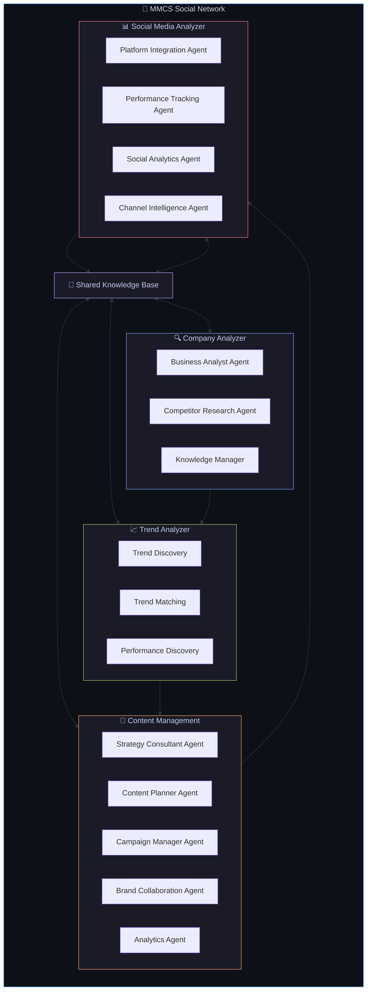
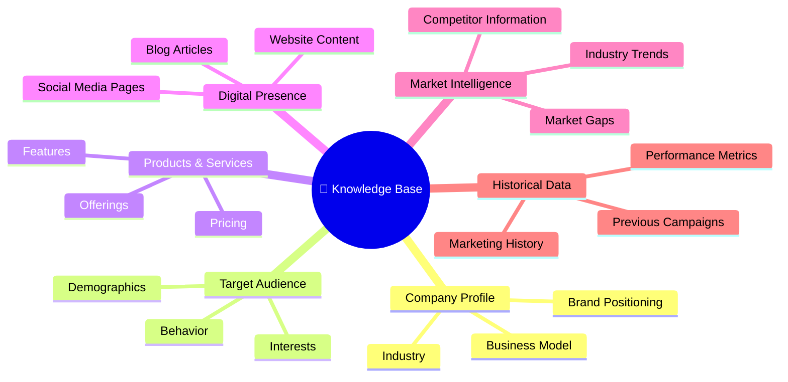

<p align="center">
  
  
  
  
  
  
</p>

<h1 align="center">🚀 MMCS Social Network</h1>

<p align="center">
  <strong>AI-Powered Marketing Intelligence Platform</strong><br/>
  A multi-agent architecture that helps businesses understand their market, create high-quality content, monitor social media performance, and continuously improve their online presence.
</p>

---

## 📖 Table of Contents

- [Overview](#-overview)
- [Architecture](#-architecture)
- [Modules](#-modules)
  - [Company Analyzer](#-company-analyzer)
  - [Trend Analyzer](#-trend-analyzer)
  - [Content Management](#-content-management)
  - [Social Media Analyzer](#-social-media-analyzer)
- [Shared Knowledge Base](#-shared-knowledge-base)
- [Workflow](#-workflow)
- [Tech Stack](#-tech-stack)
- [Getting Started](#-getting-started)
- [Project Structure](#-project-structure)
- [Benefits](#-benefits)
- [Future Roadmap](#-future-roadmap)
- [License](#-license)

---

## 🌟 Overview

The **MMCS Social Network** is not just another marketing tool — it's an **intelligent, collaborative AI ecosystem**.

Instead of relying on a single AI model, the platform is divided into **multiple specialized AI agents**. Each agent has a dedicated responsibility and collaborates with the others to make better, data-driven decisions.

Think of the platform as a **company with different departments**:

| Department | Responsibility |
|---|---|
| 🔍 **Research Division** | Researches competitors & market position |
| 📈 **Trends Division** | Tracks industry trends & discoveries |
| 📝 **Strategy Division** | Creates marketing strategies & plans |
| 🎯 **Campaign Division** | Manages & executes campaigns |
| 📊 **Analytics Division** | Monitors social media performance |

Together, these agents provide businesses with **intelligent recommendations** instead of isolated answers.

---

## 🏗 Architecture

The MMCS platform is built on four primary modules that work together seamlessly:



---

## 🧩 Modules

### 🔍 Company Analyzer

> **Purpose:** Understand the business and maintain a complete picture of its market position. This module becomes the foundation for every other AI agent.

#### Business Analyst Agent

Responsible for deeply understanding the company:

- **Company Goals** — What is the business trying to achieve?
- **Business Model** — How does the company generate revenue?
- **Target Audience** — Who are the ideal customers?
- **Brand Voice** — What tone and personality does the brand use?
- **Products & Services** — What does the company offer?
- **Market Positioning** — What makes the company unique?

> _Answers questions like: "What does the company do?", "Who are its customers?", "What makes it unique?"_

#### Competitor Research Agent

Continuously researches competitors across multiple dimensions:

| Research Area | What It Tracks |
|---|---|
| Products & Pricing | Competitor offerings and price points |
| Marketing Strategy | Ad campaigns, content approach, messaging |
| Social Presence | Follower growth, engagement, posting frequency |
| Customer Engagement | Reviews, sentiment, community interactions |

This helps identify **opportunities**, **weaknesses**, and **market gaps**.

#### Knowledge Manager

Maintains a continuously updated business knowledge repository by indexing:

- Website content & product pages
- Social media profiles & posts
- Blog articles & publications
- Business documents & reports
- Previous AI findings & recommendations

> Every other agent depends on this knowledge.

---

### 📈 Trend Analyzer

> **Purpose:** Discover what people are currently interested in and determine whether those trends align with the business. Ensures every piece of content is based on **current market demand**, not guesswork.

#### Trend Discovery

Collects trending topics from multiple sources:

| Source | Type |
|---|---|
| Google Trends | Search demand |
| Reddit | Community discussions |
| YouTube | Video content trends |
| LinkedIn | Professional trends |
| X (Twitter) | Real-time conversations |
| TikTok | Short-form content trends |
| RSS Feeds | Industry publications |
| News Websites | Breaking developments |
| Industry Blogs | Expert insights |

#### Trend Matching

Instead of following every trend blindly, the AI compares trends against:

- ✅ Company niche & expertise
- ✅ Previous campaign performance
- ✅ Customer interests & behavior
- ✅ Competitor activities & gaps

**Only relevant trends are selected** for content creation.

#### Performance Discovery

Studies historical performance data:

- Which content **performs well** and why
- Which topics receive the **most engagement**
- Which formats (video, carousel, article) **generate the most reach**
- Learns from both **successes and failures**

#### Output

| Deliverable | Frequency |
|---|---|
| Trending Topics | Daily |
| Market Reports | Weekly |
| Industry Insights | Weekly |
| Content Opportunities | Ongoing |

---

### 📝 Content Management

> **Purpose:** Transform business insights into actionable marketing strategies and campaigns. This is where ideas become content.

#### Strategy Consultant Agent

Creates high-level strategic direction:

- 📋 Marketing strategy aligned with business objectives
- 🎯 Campaign direction & creative briefs
- 📈 Growth recommendations based on data
- 💡 Business suggestions for market positioning

#### Content Planner Agent

Generates structured content plans:

- **Content Calendars** — Monthly, weekly, and daily views
- **Post Scheduling** — Optimized posting times per platform
- **Campaign Themes** — Seasonal events, trending topics, audience interests
- **Format Mix** — Balanced variety of content types

Planning is based on audience interests, business goals, trending topics, and seasonal events.

#### Campaign Manager Agent

End-to-end campaign management:

- 🚀 Campaign creation & launch
- 📅 Scheduling & timeline management
- 📊 Real-time performance tracking
- 💰 Budget allocation & optimization
- 📈 Progress monitoring & reporting

Continuously evaluates campaign effectiveness and adjusts strategy.

#### Brand Collaboration Agent

Identifies and manages potential partnerships:

- 🤝 Influencer discovery & outreach
- 🎬 Content creator collaborations
- 🏢 Brand partnership opportunities
- 📢 Co-marketing campaigns

The objective is to **maximize campaign reach and brand exposure**.

#### Analytics Agent

Measures everything that matters:

- 📊 Campaign success metrics
- 💬 Engagement rates & patterns
- 👁 Reach & impressions
- 🔄 Conversion tracking
- 👥 Audience growth trends

> Analytics are fed back into the system to **improve future decisions**.

#### Output

| Deliverable | Description |
|---|---|
| Strategy Reports | Weekly strategic recommendations |
| Content Plans | Personalized, data-driven content calendars |
| Campaign Ideas | Creative campaign concepts with projections |
| Business Recommendations | Actionable growth suggestions |
| Performance Reports | Comprehensive marketing analytics |

---

### 📊 Social Media Analyzer

> **Purpose:** Connect with all business social accounts and continuously monitor their performance. AI automatically understands what is happening across every connected platform — no manual checking required.

#### Platform Integration Agent

Connects with major social platforms:

| Platform | Data Collected |
|---|---|
| Facebook | Posts, reach, engagement, audience insights |
| Instagram | Stories, reels, posts, follower demographics |
| LinkedIn | Articles, posts, professional engagement |
| X (Twitter) | Tweets, mentions, conversations, impressions |
| TikTok | Videos, views, engagement, trend participation |
| YouTube | Videos, subscribers, watch time, analytics |

#### Performance Tracking Agent

Monitors key metrics across all platforms:

- 📈 Engagement rates & trends
- 👥 Follower growth & churn
- 👁 Impressions & reach
- 🖱 Click-through rates
- 🎯 Campaign-specific performance
- 📊 Overall business growth indicators

#### Social Analytics Agent

Deep-dive analytics including:

- **Audience Demographics** — Age, location, interests, behavior
- **Engagement Patterns** — Peak times, content preferences, interaction types
- **Platform Performance** — Cross-platform comparison & benchmarks
- **Customer Interactions** — Comments, DMs, mentions, sentiment
- **Community Growth** — Organic vs paid, retention rates

#### Channel Intelligence Agent

Provides unified insights across all connected channels:

- 🏆 **Best-performing platforms** — Where to focus resources
- ⏰ **Best posting times** — Optimized scheduling per platform
- 👥 **Audience behavior** — Cross-platform user journey
- 📈 **Platform-specific trends** — What works where
- 🔮 **Future opportunities** — Emerging channels & strategies

---

## 🧠 Shared Knowledge Base

Before any agent starts working, the system builds a **complete understanding of the business**.

The Knowledge Base acts as the **centralized memory** for all AI agents:



> Instead of repeatedly asking questions, **every agent can access this shared business knowledge**.

---

## 🔄 Workflow

The system follows a **continuous learning cycle** where every iteration improves the next:

```mermaid
graph LR
    A["📋 Company Information"] --> B["🧠 Knowledge Base"]
    B --> C["🔍 Trend Discovery"]
    C --> D["📊 Market Analysis"]
    D --> E["💡 Strategy Generation"]
    E --> F["📝 Content Planning"]
    F --> G["🚀 Campaign Execution"]
    G --> H["📱 Social Media Monitoring"]
    H --> I["📈 Analytics Collection"]
    I --> J["🔄 Knowledge Base Update"]
    J --> C

    style A fill:#1a1b27,stroke:#bb9af7,color:#c0caf5
    style B fill:#1a1b27,stroke:#7aa2f7,color:#c0caf5
    style C fill:#1a1b27,stroke:#9ece6a,color:#c0caf5
    style D fill:#1a1b27,stroke:#9ece6a,color:#c0caf5
    style E fill:#1a1b27,stroke:#ff9e64,color:#c0caf5
    style F fill:#1a1b27,stroke:#ff9e64,color:#c0caf5
    style G fill:#1a1b27,stroke:#ff9e64,color:#c0caf5
    style H fill:#1a1b27,stroke:#f7768e,color:#c0caf5
    style I fill:#1a1b27,stroke:#f7768e,color:#c0caf5
    style J fill:#1a1b27,stroke:#bb9af7,color:#c0caf5
```



> Every campaign improves the knowledge base, making future recommendations **smarter and more accurate**.

---

## 🛠 Tech Stack

| Layer | Technology | Purpose |
|---|---|---|
| **Frontend** | Next.js 15, TypeScript, shadcn/ui, Tailwind CSS | Dashboard & user interface |
| **Backend** | Python, FastAPI, Pydantic | API, business logic, AI agents |
| **AI Agents** | Multi-agent architecture | Specialized task execution |
| **Database** | PostgreSQL (planned) | Persistent data storage |
| **Knowledge Base** | Vector DB (planned) | Semantic search & retrieval |
| **Task Queue** | Celery / Redis (planned) | Async agent orchestration |

---

## 🚀 Getting Started

### Prerequisites

- **Node.js** ≥ 18.x
- **Python** ≥ 3.12
- **npm** ≥ 9.x
- **Git**

### Installation

**1. Clone the repository**

```bash
git clone https://github.com/your-org/MelbourneCatalyst.git
cd MelbourneCatalyst
```

**2. Set up the Frontend**

```bash
cd frontend
npm install
cp .env.example .env.local   # Configure environment variables
npm run dev                   # Starts on http://localhost:3000
```

**3. Set up the Backend**

```bash
cd backend
python -m venv venv
source venv/bin/activate      # On Windows: venv\Scripts\activate
pip install -r requirements.txt
cp .env.example .env          # Configure environment variables
uvicorn app.main:app --reload # Starts on http://localhost:8000
```

**4. Access the platform**

| Service | URL |
|---|---|
| Frontend Dashboard | [http://localhost:3000](http://localhost:3000) |
| Backend API | [http://localhost:8000](http://localhost:8000) |
| API Documentation | [http://localhost:8000/docs](http://localhost:8000/docs) |

---

## 📁 Project Structure

```
MelbourneCatalyst/
│
├── frontend/                    # Next.js 15 + TypeScript + shadcn/ui
│   ├── src/
│   │   ├── app/                 # App Router pages
│   │   ├── components/          # Reusable UI components
│   │   └── lib/                 # Utilities & helpers
│   ├── public/                  # Static assets
│   ├── package.json
│   └── tsconfig.json
│
├── backend/                     # Python FastAPI
│   ├── app/
│   │   ├── main.py              # FastAPI entry point
│   │   ├── config.py            # Settings & configuration
│   │   ├── api/v1/              # API routes
│   │   ├── agents/              # AI Agent modules
│   │   │   ├── company_analyzer/
│   │   │   ├── trend_analyzer/
│   │   │   ├── content_management/
│   │   │   └── social_media_analyzer/
│   │   ├── models/              # Pydantic schemas
│   │   ├── services/            # Business logic
│   │   ├── db/                  # Database layer
│   │   └── knowledge_base/      # Shared knowledge store
│   ├── tests/
│   └── requirements.txt
│
├── README.md
├── TODO.md
└── LICENSE
```

---

## ✨ Benefits

| Benefit | Description |
|---|---|
| 🤖 **Automated Market Understanding** | AI agents continuously analyze your market position |
| 🔍 **Continuous Competitor Monitoring** | Stay ahead with real-time competitor intelligence |
| 📈 **Relevant Trend Discovery** | Only trends that matter to your business |
| 💡 **AI-Driven Strategies** | Data-backed marketing recommendations |
| 📅 **Personalized Content Calendars** | Tailored to your audience and goals |
| 🚀 **Efficient Campaign Management** | End-to-end automated campaign lifecycle |
| 🤝 **Collaboration Discovery** | Find influencers and brand partners |
| 📊 **Multi-Platform Analytics** | Unified view across all social channels |
| 📚 **Historical Learning** | Every campaign makes the system smarter |
| 🔄 **Continuous Improvement** | Self-optimizing through feedback loops |

---

## 🔮 Future Roadmap

The modular architecture allows seamless addition of new agents:

| Agent | Purpose | Status |
|---|---|---|
| 🔎 SEO Intelligence Agent | Search engine optimization insights | Planned |
| 🎯 Lead Generation Agent | Automated lead discovery & scoring | Planned |
| 💬 Customer Sentiment Agent | Real-time sentiment analysis | Planned |
| 🎬 AI Video Generation Agent | Automated video content creation | Planned |
| 📧 Email Marketing Agent | Smart email campaign management | Planned |
| 🌐 Website Performance Agent | Site speed, UX, and conversion optimization | Planned |
| 📇 CRM Intelligence Agent | Customer relationship insights | Planned |
| 📉 Sales Forecasting Agent | Revenue prediction & planning | Planned |
| 🎧 Customer Support Agent | AI-powered customer service | Planned |
| 💰 ROI Prediction Agent | Return on investment forecasting | Planned |

---

## 📄 License

This project is licensed under the terms specified in the [LICENSE](LICENSE) file.

---

<p align="center">
  <strong>Built with ❤️ by the MMCS Team</strong><br/>
  <em>Intelligent Marketing. Collaborative AI. Continuous Growth.</em>
</p>